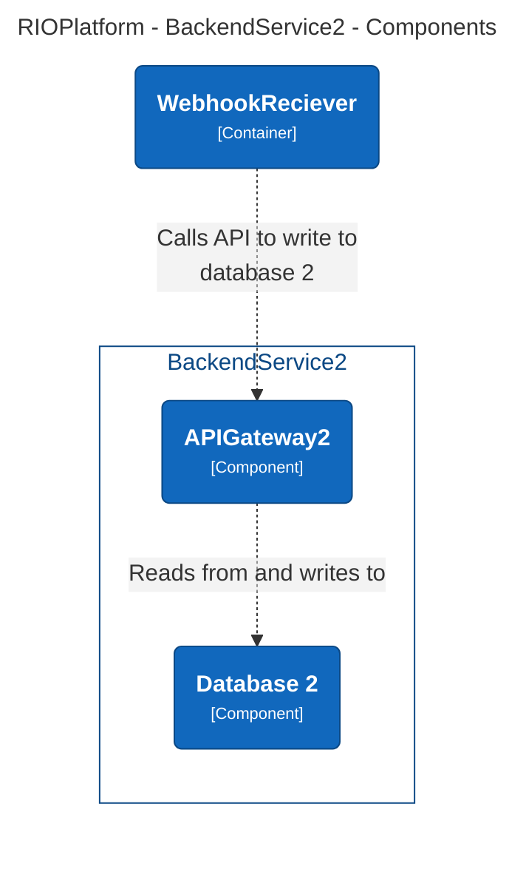
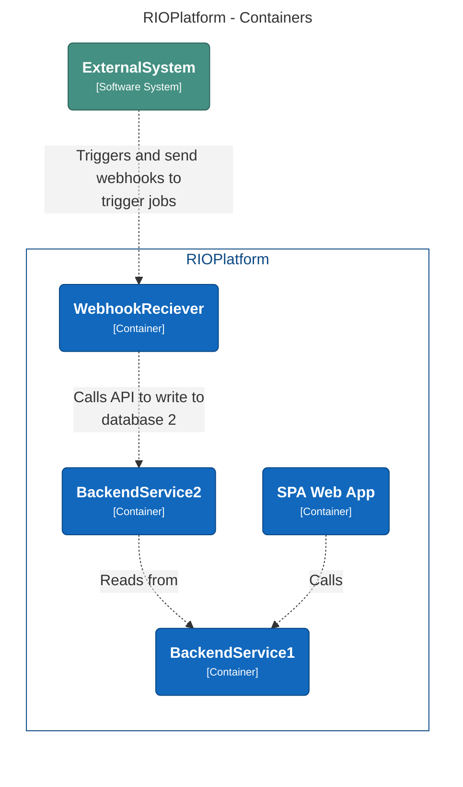
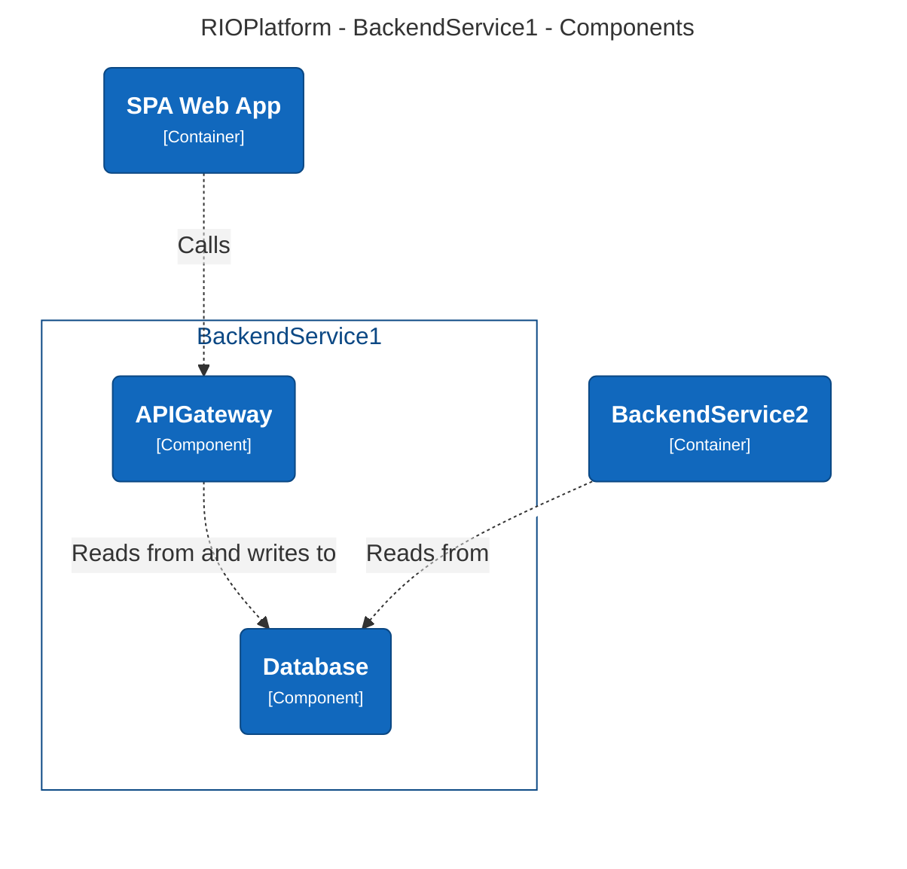

# Background

> This file is part of the digital-doc module, originally created 6/16/2024 10:51:51 PM

The Platform team is tasked to provide infrastructure and guidance for a new initiative named RIO. The RIO project is tasked with building both internal and extern web services.

The project does not yet know the end state but have invited us to experiment to show what we can deliver within a week to support the initial architecture.

in this experiment we have chosen to use terraform for our IaC tool.
Any pipeline will be targeting GitHub actions for deployment.
The project will be created to use Azure as a public cloud platform.

The components selected might not be production grade ready inhouse yet, but we will build services that are within the company standard.

## Project folder structure

This experiment is structured in a single repository contain the whole setup. This structure might deviate from the structure needed for the final solution as multiple teams and responsibilities most likely will be involved at a later state.

All application code for the experiment is contained in subfolders under the [**components**](./components) folder.

All terraform code is contained under in the [**terraform**](./terraform) folder.
The different stacks are contained in seperate sub folders. This is done to support the devops flow and preserve the sanity of the team members experimenting together.

In the [**terraform/stacks**](./terraform/stacks/) folder all the configurations for the core, frontend and backend stacks are sorted in subfolders. This makes it simpler to create pipelines to support the testing and deployment of the stacks. In other scenarios this structure might use seperate repositories.

Any terraform modules created to support multiple stacks are created in subfolders within the [**terraform/modules**](./terraform/modules/) folder. The modules path is identified with the path '../../modules/module-name/' in the stacks.

Any pipelines for GitHub are stored under [**.github/workflows**](./.github/workflows/) and named after the stack they are set up to use.

## Components

> This chapter will describe the initial components needed for this experiment

----

### Core

TODO document core components

The project weill deploy all components within a single subscription in Azure.
each stack will exist within it's own resource group where it makes sense. We will use a simplified naming convention for the experiment and thereby deviating from the company standard. This is approved by the architects.

### Frontend spa

TODO document

### Backend service 1

TODO document

### Backend service 2

TODO document

## Setup

> This chapter will describe all the steps needed to deploy the experiment

TODO document

## Test

> This chapter will describe the testing setup enabled in this experiment

TODO document

### OSS and common services

> this chapter will describe any common services and frameworks that have been included to support the experiment. Documentation for these are linked in the table below.

| name | description |
| ---- | ----------- |
| [vscode](https://code.visualstudio.com) | lightweight IDE |
| [terraform-docs](https://terraform-docs.io/user-guide/introduction/) | tool to automate updating of documentation for terraform modules |
| [Structurizr Lite](https://docs.structurizr.com/lite) | C4 diagrams as code tool |
|     |      |
|     |      |
|     |      |

## Known issues

> This chapter will describe any known errors with regards to this experiment

## Todo

> This chapter will describe the next steps to improve the experiment
